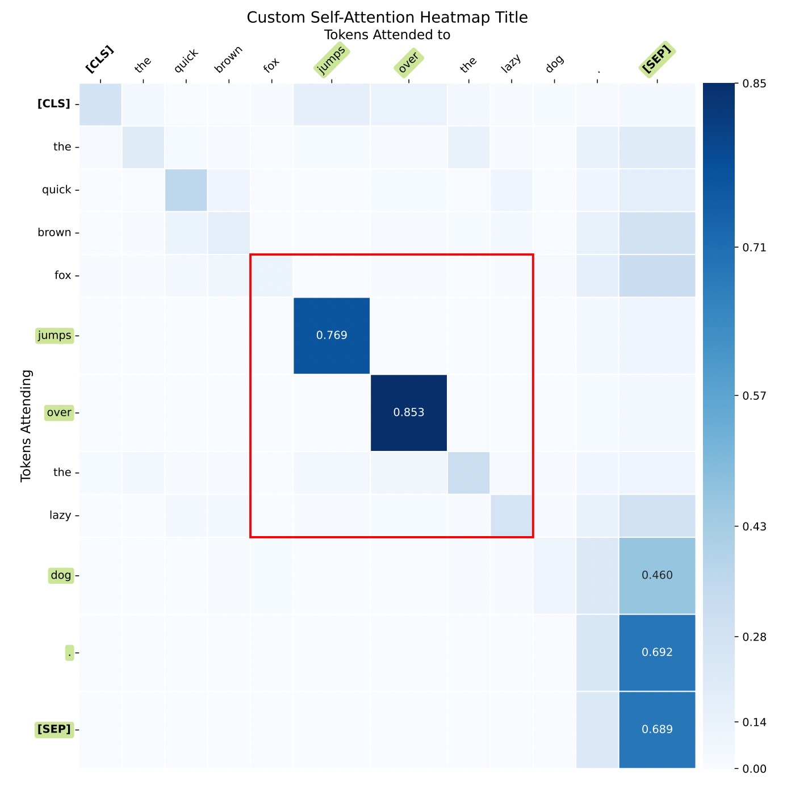

# IzzyViz

**IzzyViz** is a Python library designed to visualize attention scores in transformer models. It provides flexible visualization functions that can handle different attention scenarios and model architectures, including encoder-only, decoder-only, and encoder-decoder models.

## Table of Contents

- [Features](#features)
- [Installation](#installation)
- [Dependencies](#dependencies)
- [Quick Start](#quick-start)
- [Usage Examples](#usage-examples)
  - [Encoder-Only Models](#encoder-only-models)
    - [Self-Attention Mode](#self-attention-mode)
    - [Question-Context Mode](#question-context-mode)
  - [Decoder-Only Models](#decoder-only-models)
    - [Full Sequence](#full-sequence)
    - [Generated-to-Source Attention](#generated-to-source-attention)
  - [Encoder-Decoder Models](#encoder-decoder-models)
    - [Cross-Attention](#cross-attention)
- [Function Reference](#function-reference)
  - [`visualize_attention_encoder_only`](#visualize_attention_encoder_only)
  - [`visualize_attention_decoder_only`](#visualize_attention_decoder_only)
  - [`visualize_attention_encoder_decoder`](#visualize_attention_encoder_decoder)
- [Contributing](#contributing)
- [License](#license)

## Features

- **Flexible Visualization Functions**: Supports multiple transformer architectures:
  - **Encoder-Only Models** (e.g., BERT)
  - **Decoder-Only Models** (e.g., GPT-2)
  - **Encoder-Decoder Models** (e.g., T5, BART)
- **Multiple Visualization Modes**:
  - **Self-Attention**
  - **Question-Context Attention**
  - **Cross-Attention**
  - **Generated-to-Source Attention**
- **Highlighting and Annotation**:
  - Highlights top attention scores with enlarged cells and annotations.
  - Customizable region highlighting with red boxes around specified areas.
- **Customizable Visualization**:
  - Adjustable color mapping and normalization.
  - Configurable parameters to suit different analysis needs.
- **High-Quality Outputs**:
  - Generates heatmaps saved as PDF files for easy sharing and publication.

## Installation

You can install **IzzyViz** via `pip`:

```bash
git clone https://github.com/lxz333/IzzyViz.git
cd IzzyViz
pip install .
```

## Dependencies

**IzzyViz** requires the following packages:

- Python 3.6 or higher
- `matplotlib>=3.0.0`
- `numpy>=1.15.0,<2.0.0`
- `torch>=1.0.0`
- `transformers>=4.0.0`
- `pandas>=1.4.0`
- `pybind11>=2.12`

These dependencies will be installed automatically when you install **IzzyViz** via `pip`.

## Quick Start

Here's a quick example of how to use **IzzyViz** to visualize self-attention in an encoder-only model (e.g., BERT):

```python
from transformers import BertTokenizer, BertModel
import torch

# Load model and tokenizer
tokenizer = BertTokenizer.from_pretrained('bert-base-uncased')
model = BertModel.from_pretrained('bert-base-uncased')

# Single sentence input
sentence = "The quick brown fox jumps over the lazy dog."
inputs = tokenizer(sentence, return_tensors="pt", add_special_tokens=True)
tokens = tokenizer.convert_ids_to_tokens(inputs['input_ids'][0])

# Get attention weights
with torch.no_grad():
    outputs = model(**inputs, output_attentions=True)
    attentions = outputs.attentions

# Specify regions to highlight (e.g., words "fox" to "lazy")
left_top_cells = [(4, 4)]   # Starting cell (row index, column index)
right_bottom_cells = [(8, 8)]  # Ending cell (row index, column index)

# Visualize attention
visualize_attention_encoder_only(
    attentions,
    tokens,
    layer=-1,
    head=8,
    top_n=5,
    mode='self_attention',
    left_top_cells=left_top_cells,
    right_bottom_cells=right_bottom_cells,
    plot_titles=["Custom Self-Attention Heatmap Title"]
)
```

This will generate a heatmap PDF file named `self_attention_heatmap.pdf`.


## Usage Examples

### Encoder-Only Models

#### Self-Attention Mode

**Description**: Visualizes self-attention within a single sentence in an encoder-only model like BERT.

**Example**:

```python
from izzyviz.visualization import visualize_attention_encoder_only
from transformers import BertTokenizer, BertModel
import torch

# Load model and tokenizer
tokenizer = BertTokenizer.from_pretrained('bert-base-uncased')
model = BertModel.from_pretrained('bert-base-uncased', output_attentions=True)

# Single sentence input
sentence = "Deep learning models are revolutionizing AI."
inputs = tokenizer(sentence, return_tensors="pt", add_special_tokens=True)
tokens = tokenizer.convert_ids_to_tokens(inputs['input_ids'][0])

# Get attention weights
with torch.no_grad():
    outputs = model(**inputs)
    attentions = outputs.attentions

# Visualize self-attention
visualize_attention_encoder_only(
    attentions=attentions,
    tokens=tokens,
    layer=-1,    # Last layer
    head=0,      # First attention head
    mode='self_attention'
)
```

**Output**: A PDF file named `self_attention_heatmap.pdf`.

#### Question-Context Mode

**Description**: Visualizes attention between a question and a context passage in an encoder-only model.

**Example**:

```python
from izzyviz.visualization import visualize_attention_encoder_only
from transformers import BertTokenizer, BertModel
import torch

# Load model and tokenizer
tokenizer = BertTokenizer.from_pretrained('bert-base-uncased')
model = BertModel.from_pretrained('bert-base-uncased', output_attentions=True)

# Prepare input sentences
question = "What is the capital of France?"
context = "Paris is the capital city of France, known for its art, fashion, and culture."
inputs = tokenizer(question, context, return_tensors="pt", add_special_tokens=True)

input_ids = inputs['input_ids']
token_type_ids = inputs['token_type_ids'][0]
question_end = (token_type_ids == 0).sum().item()  # Index where question ends
tokens = tokenizer.convert_ids_to_tokens(input_ids[0])

# Get attention weights
with torch.no_grad():
    outputs = model(**inputs)
    attentions = outputs.attentions

# Visualize question-context attention
visualize_attention_encoder_only(
    attentions=attentions,
    tokens=tokens,
    layer=-1,        # Last layer
    head=0,          # First attention head
    question_end=question_end,
    mode='question_context'
)
```

**Output**: A PDF file named `QC_attention_heatmaps.pdf` containing five subplots showing different attention patterns between the question and context.

### Decoder-Only Models

#### Full Sequence

**Description**: Visualizes self-attention over the full input sequence in a decoder-only model like GPT-2.

**Example**:

```python
from izzyviz.visualization import visualize_attention_decoder_only
from transformers import GPT2Tokenizer, GPT2LMHeadModel
import torch

# Load model and tokenizer
tokenizer = GPT2Tokenizer.from_pretrained('gpt2')
model = GPT2LMHeadModel.from_pretrained('gpt2', output_attentions=True)
model.eval()

# Input source text
source_text = "Once upon a time, in a faraway land, there lived a wise old man."
input_ids = tokenizer.encode(source_text, return_tensors='pt')
source_tokens = tokenizer.convert_ids_to_tokens(input_ids[0])

# Get attention weights
with torch.no_grad():
    outputs = model(input_ids)
    attentions = outputs.attentions  # List of attention matrices from each layer

# Visualize full sequence attention
visualize_attention_decoder_only(
    attentions=attentions,
    source_tokens=source_tokens,
    generated_tokens=[],  # No generated tokens
    layer=-1,             # Last layer
    head=0,               # First attention head
    use_case='full_sequence'
)
```

**Output**: A PDF file named `decoder_self_attention_heatmap.pdf`.

#### Generated-to-Source Attention

**Description**: Visualizes how generated tokens attend to source tokens in a decoder-only model.

**Example**:

```python
from izzyviz.visualization import visualize_attention_decoder_only
from transformers import GPT2Tokenizer, GPT2LMHeadModel
import torch

# Load model and tokenizer
tokenizer = GPT2Tokenizer.from_pretrained('gpt2')
model = GPT2LMHeadModel.from_pretrained('gpt2', output_attentions=True)
model.eval()

# Input source text
source_text = "Climate change is a pressing issue"
input_ids = tokenizer.encode(source_text, return_tensors='pt')
source_tokens = tokenizer.convert_ids_to_tokens(input_ids[0])

# Generate text
max_length = input_ids.shape[1] + 10
with torch.no_grad():
    outputs = model.generate(
        input_ids,
        max_length=max_length,
        output_attentions=True,
        return_dict_in_generate=True
    )

# Get the full sequence
full_input_ids = outputs.sequences
full_tokens = tokenizer.convert_ids_to_tokens(full_input_ids[0])
generated_tokens = full_tokens[len(source_tokens):]

# Get attentions for the full sequence
with torch.no_grad():
    full_outputs = model(full_input_ids)
    attentions = full_outputs.attentions

# Visualize generated-to-source attention
visualize_attention_decoder_only(
    attentions=attentions,
    source_tokens=source_tokens,
    generated_tokens=generated_tokens,
    layer=-1,               # Last layer
    head=0,                 # First attention head
    use_case='generated_to_source'
)
```

**Output**: A PDF file named `decoder_generated_to_source_attention_heatmap.pdf`.

### Encoder-Decoder Models

#### Cross-Attention

**Description**: Visualizes cross-attention between the decoder and encoder outputs in an encoder-decoder model like T5.

**Example**:

```python
from transformers import T5ForConditionalGeneration, T5Tokenizer
import torch
import matplotlib.pyplot as plt
import numpy as np

# Load model and tokenizer
model_name = "t5-small"  # Replace with your desired model
tokenizer = T5Tokenizer.from_pretrained(model_name)
model = T5ForConditionalGeneration.from_pretrained(model_name, output_attentions=True)

# Input source text
source_text = "I am happy."
input_ids = tokenizer(source_text, return_tensors="pt").input_ids

# Generate output text (inference)
output = model.generate(input_ids, return_dict_in_generate=True, output_attentions=True, max_new_tokens=10)
generated_tokens = tokenizer.convert_ids_to_tokens(output.sequences[0])

# Extract cross-attention weights
cross_attentions = output.cross_attentions  # Tuple of tuples

# Specify parameters
layer_index = -2  # Last layer
head_index = 4    # Desired attention head

# Collect attention scores for all generated tokens
all_attention_scores = []
for token_index in range(len(cross_attentions)):
    attention_tensor = cross_attentions[token_index][layer_index]  # Attention for the given token and layer
    head_attention = attention_tensor[0, head_index, :, :].squeeze(0).detach().numpy()  # Squeeze singleton dim
    all_attention_scores.append(head_attention)

# Stack attention scores for all tokens
attention_matrix = np.vstack(all_attention_scores)

# Filter out <pad> tokens from decoder tokens
if len(generated_tokens) > attention_matrix.shape[0]:
    generated_tokens = [token for token in generated_tokens if token != "<pad>"]

# Ensure alignment with the attention matrix
generated_tokens = generated_tokens[:attention_matrix.shape[0]]

# Visualize cross-attention heatmap for the selected head
source_tokens = tokenizer.convert_ids_to_tokens(input_ids[0])

# Plot the attention matrix
visualize_attention_encoder_decoder(attention_matrix, source_tokens, generated_tokens)
```

**Output**: A PDF file named `cross_attention_heatmap.pdf`.

## Function Reference

### `visualize_attention_encoder_only`

**Signature**:

```python
visualize_attention_encoder_only(
    attentions,
    tokens,
    layer,
    head,
    question_end=None,
    top_n=3,
    enlarged_size=1.8,
    gamma=1.5,
    mode='self_attention',
    plot_titles=None,
    left_top_cells=None,
    right_bottom_cells=None
)
```

**Parameters**:

- `attentions`: List of attention matrices from the model.
- `tokens`: List of token labels to display on the heatmaps.
- `layer`: The layer number of the attention to visualize.
- `head`: The head number of the attention to visualize.
- `question_end`: The index where the first sentence ends in the token list (used in `question_context` mode).
- `top_n`: The number of top attention scores to highlight.
- `enlarged_size`: Factor by which to enlarge the top cells.
- `gamma`: Gamma value for the power normalization of the colormap.
- `mode`: The mode of visualization (`'self_attention'` or `'question_context'`).
- `plot_titles`: List of titles for the subplots. If `None`, default titles are used.
- `left_top_cells`: List of (row, col) tuples for the top-left cells of regions to highlight.
- `right_bottom_cells`: List of (row, col) tuples for the bottom-right cells of regions to highlight.

**Description**:

Visualizes attention matrices for encoder-only models in different modes. Generates heatmaps saved as PDF files.

---

### `visualize_attention_decoder_only`

**Signature**:

```python
visualize_attention_decoder_only(
    attentions,
    source_tokens,
    generated_tokens,
    layer,
    head,
    top_n=3,
    enlarged_size=1.8,
    gamma=1.5,
    plot_titles=None,
    left_top_cells=None,
    right_bottom_cells=None,
    use_case='full_sequence'
)
```

**Parameters**:

- `attentions`: List of attention matrices from the model.
- `source_tokens`: List of source token labels.
- `generated_tokens`: List of generated token labels.
- `layer`: The layer number of the attention to visualize.
- `head`: The head number of the attention to visualize.
- `top_n`: The number of top attention scores to highlight.
- `enlarged_size`: Factor by which to enlarge the top cells.
- `gamma`: Gamma value for the power normalization of the colormap.
- `plot_titles`: List of titles for the subplots. If `None`, default titles are used.
- `left_top_cells`: List of (row, col) tuples for the top-left cells of regions to highlight.
- `right_bottom_cells`: List of (row, col) tuples for the bottom-right cells of regions to highlight.
- `use_case`: The specific use case to visualize. Options are:
  - `'full_sequence'`: Input sequence attending to itself.
  - `'self_attention_source'`: Self-Attention for source tokens.
  - `'generated_to_source'`: Generated tokens attending to source tokens.
  - `'self_attention_generated'`: Self-Attention for generated tokens.

**Description**:

Visualizes attention matrices for decoder-only models in different use cases. Generates heatmaps saved as PDF files.

---

### `visualize_attention_encoder_decoder`

**Signature**:

```python
visualize_attention_encoder_decoder(
    attention_matrix,
    source_tokens,
    generated_tokens,
    top_n=3,
    enlarged_size=1.8,
    gamma=1.5,
    plot_title=None,
    left_top_cells=None,
    right_bottom_cells=None,
    save_path="cross_attention_heatmap.pdf",
    use_case='cross_attention'
)
```

**Parameters**:

- `attention_matrix`: The attention matrix (NumPy array or PyTorch tensor).
- `source_tokens`: List of source token labels.
- `generated_tokens`: List of generated token labels.
- `top_n`: The number of top attention scores to highlight.
- `enlarged_size`: Factor by which to enlarge the top cells.
- `gamma`: Gamma value for the power normalization of the colormap.
- `plot_title`: Title for the plot.
- `left_top_cells`: List of (row, col) tuples for the top-left cells of regions to highlight.
- `right_bottom_cells`: List of (row, col) tuples for the bottom-right cells of regions to highlight.
- `save_path`: File path to save the generated heatmap PDF.
- `use_case`: Type of attention to visualize. Options are:
  - `'cross_attention'`
  - `'encoder_self_attention'`
  - `'decoder_self_attention'`

**Description**:

Visualizes attention matrices for encoder-decoder models in different use cases. Generates heatmaps saved as PDF files.

---

**Specifying Regions to Highlight**:

- The heatmap grid uses zero-based indexing.
- Row indices increase from top to bottom.
- Column indices increase from left to right.
- Indices must be within the dimensions of the attention matrix.

**Example**:

To highlight a region from row 1 to row 3 and column 2 to column 4:

```python
left_top_cells = [(1, 2)]
right_bottom_cells = [(3, 4)]
```

## Contributing

Contributions are welcome! If you have ideas for improvements or encounter any issues, please open an issue or submit a pull request on [GitHub](https://github.com/lxz333/IzzyViz).

## License

This project is licensed under the MIT License - see the [LICENSE](LICENSE) file for details.

---

# Changelog

- **Updated Functionality**: The `visualize_attention` function has been replaced with specialized functions for different model architectures.
  - `visualize_attention_encoder_only`
  - `visualize_attention_decoder_only`
  - `visualize_attention_encoder_decoder`
- **Enhanced Flexibility**: The new functions provide more control and customization options for different use cases.
- **Improved Documentation**: The README and function docstrings have been updated to reflect the new changes.

# Getting Help

If you have any questions or need assistance, feel free to open an issue on GitHub or reach out to the maintainers.

---

Thank you for using **IzzyViz**! We hope this tool aids in your exploration and understanding of attention mechanisms in transformer models.
