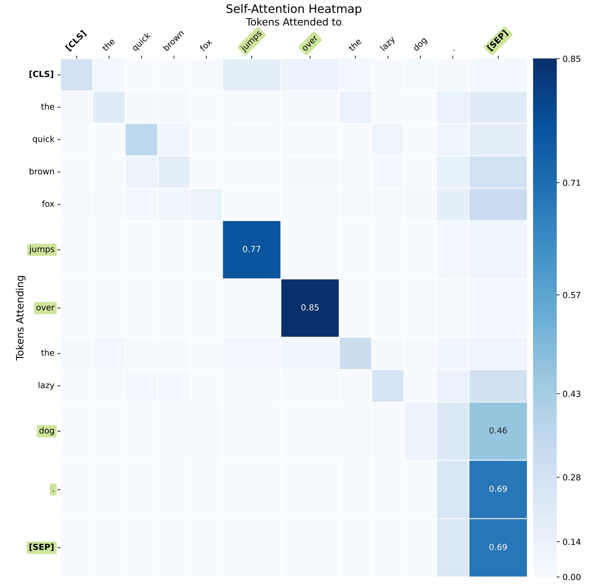
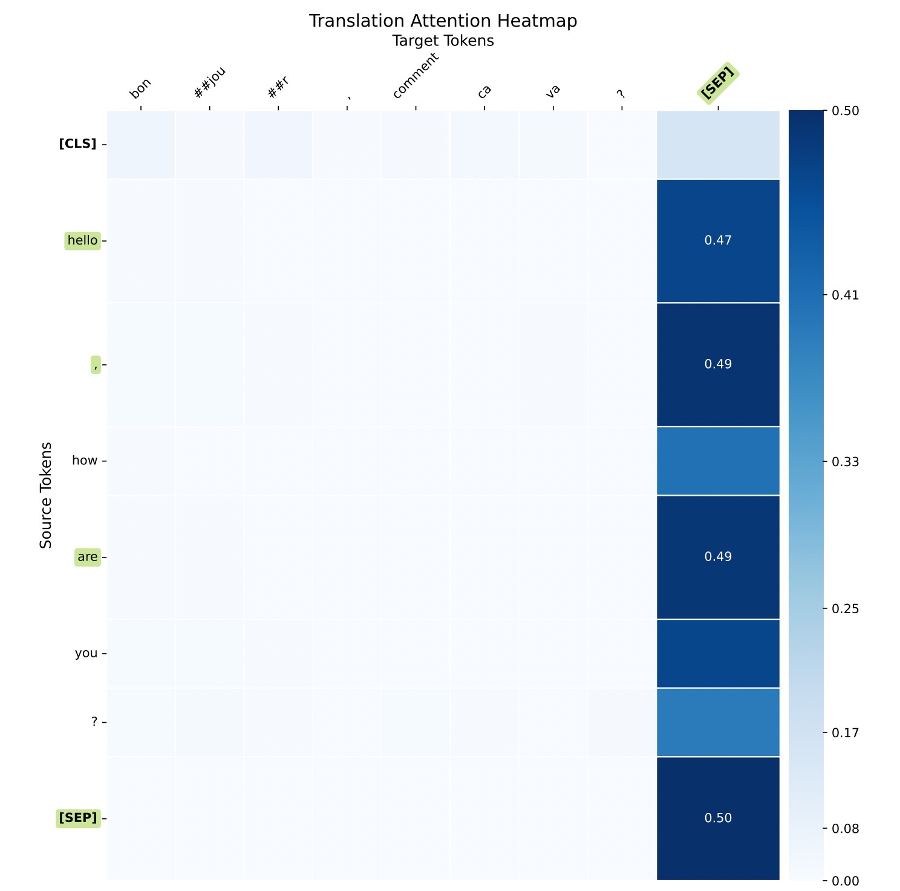

# IzzyViz

**IzzyViz** is a Python library designed to visualize attention scores in transformer models. It provides flexible visualization functions that can handle different attention scenarios, including self-attention, question-context attention, and translation attention.

## Table of Contents

- [Features](#features)
- [Installation](#installation)
- [Dependencies](#dependencies)
- [Quick Start](#quick-start)
- [Usage Examples](#usage-examples)
  - [Question and Context Mode](#question-and-context-mode)
  - [Self-Attention Mode](#self-attention-mode)
  - [Translation Mode](#translation-mode)
- [Function Reference](#function-reference)
- [Contributing](#contributing)
- [License](#license)

## Features

- Visualize attention matrices from transformer models.
- Supports multiple modes:
  - **Question and Context Mode**: Visualizes attention between a question and a context passage.
  - **Self-Attention Mode**: Visualizes self-attention within a single sentence.
  - **Translation Mode**: Visualizes attention between source and target sentences in translation tasks.
- Highlights top attention scores with enlarged grid cells and annotations.
- Customizable color mapping and normalization.
- Generates high-quality heatmaps saved as PDF files.

## Installation

You can install **IzzyViz** via `pip`:

```bash
git clone https://github.com/lxz333/IzzyViz.git
cd IzzyViz
pip install .
```

## Dependencies

**IzzyViz** requires the following packages:

- Python 3.6 or higher
- `matplotlib>=3.0.0`
- `numpy>=1.15.0,<2.0.0`
- `torch>=1.0.0`
- `transformers>=4.0.0`
- `pandas>=1.4.0`
- `pybind11>=2.12`

These dependencies will be installed automatically when you install **IzzyViz** via `pip`.

## Quick Start

Here's a quick example of how to use **IzzyViz** to visualize attention in self-attention mode:

```python
from izzyviz import visualize_attention
from transformers import BertTokenizer, BertModel
import torch

# Load model and tokenizer
tokenizer = BertTokenizer.from_pretrained('bert-base-uncased')
model = BertModel.from_pretrained('bert-base-uncased')

# Single sentence input
sentence = "The quick brown fox jumps over the lazy dog."
inputs = tokenizer(sentence, return_tensors="pt", add_special_tokens=True)
tokens = tokenizer.convert_ids_to_tokens(inputs['input_ids'][0])

# Get attention weights
with torch.no_grad():
    outputs = model(**inputs, output_attentions=True)
    attentions = outputs.attentions

# Visualize attention
visualize_attention(
    attentions,
    tokens,
    layer=-1,
    head=0,
    top_n=5,
    mode='self_attention',
    plot_titles=["Custom Self-Attention Heatmap Title"]
)
```

This will generate a heatmap PDF file named `self_attention_heatmap.pdf`.

## Usage Examples

### Question and Context Mode

**Description:** Visualizes attention between a question and a context passage. Generates five subplots showing different attention patterns.

**Example:**

```python
from izzyviz import visualize_attention
from transformers import BertTokenizer, BertModel
import torch

# Load model and tokenizer
tokenizer = BertTokenizer.from_pretrained('bert-base-uncased')
model = BertModel.from_pretrained('bert-base-uncased')

# Prepare input sentences
question = "Where is the Eiffel Tower?"
context = "The Eiffel Tower is located in Paris, France."
inputs = tokenizer(question, context, return_tensors="pt", add_special_tokens=True)

input_ids = inputs['input_ids']
token_type_ids = inputs['token_type_ids'][0]
question_end = (token_type_ids == 0).sum().item()  # Index where question ends
tokens = tokenizer.convert_ids_to_tokens(input_ids[0])

# Get attention weights
with torch.no_grad():
    outputs = model(**inputs, output_attentions=True)
    attentions = outputs.attentions

# Visualize attention
visualize_attention(
    attentions,
    tokens,
    layer=-1,
    head=5,
    question_end=question_end,
    top_n=6,
    mode='question_context'
)
```

**Output:** A PDF file named `QC_attention_heatmaps.pdf` containing five subplots:

- A -> A (Question attending to Question)
- B -> B (Context attending to Context)
- A -> B (Question attending to Context)
- B -> A (Context attending to Question)
- All -> All (All tokens attending to all tokens)

[View the PDF](images/QC_attention_heatmaps.pdf)

### Self-Attention Mode

**Description:** Visualizes self-attention within a single sentence. Generates one heatmap showing how each token attends to every other token.

**Example:**

```python
from izzyviz import visualize_attention
from transformers import BertTokenizer, BertModel
import torch

# Load model and tokenizer
tokenizer = BertTokenizer.from_pretrained('bert-base-uncased')
model = BertModel.from_pretrained('bert-base-uncased')

# Single sentence input
sentence = "The quick brown fox jumps over the lazy dog."
inputs = tokenizer(sentence, return_tensors="pt", add_special_tokens=True)
tokens = tokenizer.convert_ids_to_tokens(inputs['input_ids'][0])

# Get attention weights
with torch.no_grad():
    outputs = model(**inputs, output_attentions=True)
    attentions = outputs.attentions

# Visualize attention
visualize_attention(
    attentions,
    tokens,
    layer=-1,
    head=8,
    top_n=5,
    mode='self_attention'
)
```

**Output:** A PDF file named `self_attention_heatmap.pdf`.



### Translation Mode

**Description:** Visualizes attention between source and target sentences in translation tasks. Generates one heatmap with source tokens on the y-axis and target tokens on the x-axis.

**Example:**

```python
from izzyviz import visualize_attention
from transformers import MarianTokenizer, MarianMTModel
import torch

# Load model and tokenizer for translation
model_name = 'Helsinki-NLP/opus-mt-en-fr'  # English to French model
tokenizer = MarianTokenizer.from_pretrained(model_name)
model = MarianMTModel.from_pretrained(model_name)

# Source and target sentences
source_sentence = "Hello, how are you?"
inputs = tokenizer(source_sentence, return_tensors="pt")
input_ids = inputs['input_ids']
source_tokens = tokenizer.convert_ids_to_tokens(input_ids[0])

# Generate translation and get attentions
with torch.no_grad():
    outputs = model.generate(
        **inputs,
        num_beams=5,
        num_return_sequences=1,
        output_attentions=True,
        return_dict_in_generate=True
    )

# Extract attentions
attentions = outputs.cross_attentions  # List of cross-attention tensors
target_ids = outputs.sequences
target_tokens = tokenizer.convert_ids_to_tokens(target_ids[0])
tokens = source_tokens + target_tokens  # Concatenate for visualization
question_end = len(source_tokens)  # Index where source tokens end

# Visualize attention
visualize_attention(
    attentions,
    tokens,
    layer=-1,
    head=5,
    question_end=question_end,
    top_n=4,
    mode='translation'
)
```

**Output:** A PDF file named `translation_attention_heatmap.pdf`.



**Note:** For translation models, you need to access cross-attention weights between the encoder and decoder.

## Function Reference

### `visualize_attention`

**Signature:**

```python
visualize_attention(
    attentions,
    tokens,
    layer,
    head,
    question_end=None,
    top_n=3,
    enlarged_size=1.8,
    gamma=1.5,
    mode='self_attention',
    plot_titles=None
)
```

**Parameters:**

- `attentions`: List of attention tensors from the model. No default value.
- `tokens`: List of token strings corresponding to the input IDs. No default value.
- `layer`: Index of the layer to visualize (e.g., `-1` for the last layer). No default value.
- `head`: Index of the attention head to visualize. No default value.
- `question_end`: Index where the first sentence ends in the token list (required for `question_context` and `translation` modes). Default value is `None`.
- `top_n`: Number of top attention scores to highlight. Default value is `3`. If there is a tie in the attention scores, all attention score cells will be highlighted and enlarged. The attention scores displayed in the center of the enlarged cells are rounded to two decimal places.
- `enlarged_size`: Factor by which to enlarge the top cells. Default value is `1.8`.
- `gamma`: Gamma value for the power normalization of the colormap. Default value is `1.5`.
- `mode`: Visualization mode (`'question_context'`, `'self_attention'`, or `'translation'`). Default mode is `self_attention`.
- `plot_titles`: List of custom titles for the subplots. The required number of titles depends on the mode:
  - **Question-Context Mode**: List of 5 titles.
  - **Self-Attention Mode**: List with 1 title.
  - **Translation Mode**: List with 1 title.

**Description:**

Generates attention heatmaps based on the specified mode and parameters. The heatmaps are saved as PDF files in the current directory.

## Contributing

Contributions are welcome! If you have ideas for improvements or encounter any issues, please open an issue or submit a pull request on [GitHub](https://github.com/lxz333/IzzyViz).

## License

This project is licensed under the MIT License - see the [LICENSE](LICENSE) file for details.

---
